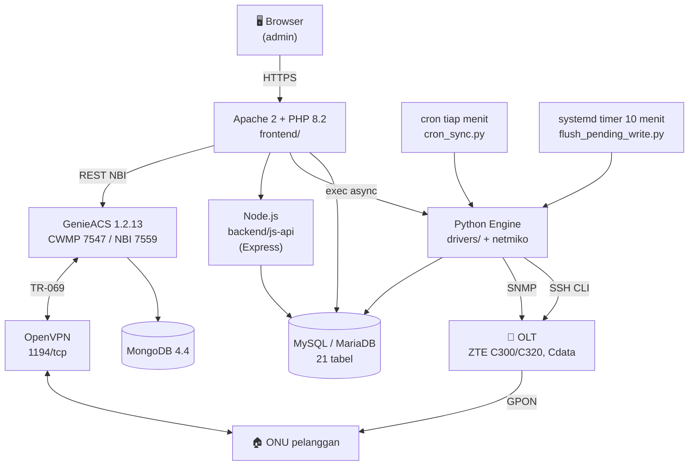

<div align="center">

# 📡 SmartOLT

**Aplikasi manajemen OLT/ONU GPON berbasis web** — monitoring real-time, auto-discovery, konfigurasi ONU multi-vendor, dan manajemen TR-069 dalam satu dashboard.


**Versi:** 1.0
**Author:** Erlangga Alfian
**Source code:** https://github.com/erlanggaalfian/smartolt

</div>

---

## 📋 Daftar Isi

1. [Fitur Aplikasi](#-fitur-aplikasi)
2. [Halaman Web](#-halaman-web)
3. [OLT yang Didukung](#-olt-yang-didukung)
4. [Tampilan Aplikasi](#-tampilan-aplikasi)
5. [Arsitektur](#-arsitektur)
6. [Stack Teknologi](#-stack-teknologi)
7. [Alur Kerja Singkat](#-alur-kerja-singkat)
8. [Persyaratan Server](#-persyaratan-server)
9. [Struktur Direktori](#-struktur-direktori)
10. [Struktur Database](#-struktur-database)
11. [Source Code Resmi](#-source-code-resmi)
12. [Instalasi Baru](#-instalasi-baru)
13. [Setup Admin Pertama](#-setup-admin-pertama)
14. [Upgrade / Pembaruan](#-upgrade--pembaruan)
15. [Uninstall](#-uninstall)
16. [Backup Opsional](#-backup-opsional)
17. [Keamanan](#-keamanan)
18. [Troubleshooting](#-troubleshooting)
19. [Lisensi & Kontribusi](#-lisensi--kontribusi)

---

## ⚙️ Fitur Aplikasi

### Monitoring & Discovery

| Fitur | Keterangan |
|---|---|
| Auto-discovery ONU | Deteksi ONU baru per shelf/slot/port PON |
| Sinkronisasi background | Cron tiap menit: status online/offline, nama, sinyal Rx ONU/OLT — tanpa membebani UI |
| Sumber data hybrid | Tampilan baca cepat dari database, diperbarui polling SNMP; kalau sinkron CLI gagal, UI tetap pakai data DB terakhir (bukan kosong/error) |
| Histori sinyal | Tabel `onu_history` menyimpan Rx power + traffic counter berkala |
| Health check OLT | CPU load, RAM usage, suhu board per OLT |

### Manajemen ONU

| Fitur | Keterangan |
|---|---|
| Authorize ONU | Daftarkan ONU baru dari halaman Unconfigured |
| Hapus / reboot ONU | Aksi langsung dari web |
| Enable / disable ONU | Tanpa menghapus konfigurasi |
| Konfigurasi WAN | VLAN, mode DHCP / PPPoE / Static per ONU |
| Replace ONU | Ganti perangkat, konfigurasi dan deskripsi ikut dipindah |
| Statistik traffic | Grafik Rx/Tx bytes & packets |
| Speed profile | Profil bandwidth upstream/downstream per OLT |
| Splitter & GPS | Pemetaan splitter dengan koordinat latitude/longitude |

### Manajemen OLT

| Fitur | Keterangan |
|---|---|
| Multi-OLT | Mendukung IP sama dengan port SSH berbeda |
| Setup SNMP | Community RO/RW langsung dari UI |
| VLAN | Tambah dan lihat VLAN per OLT |
| Backup konfigurasi | Simpan config OLT ke tabel `config_backups` |

### TR-069 / GenieACS

| Fitur | Keterangan |
|---|---|
| Manajemen ACS | Profil TR-069 (ACS URL, kredensial) per ONU |
| Akses WAN otomatis | ONU FiberHome baru langsung bisa diakses GUI web dari WAN saat Inform pertama — tanpa dibuka manual |
| Simpan Akses WAN | Satu tombol mengirim ACL Enable + Remote Access dalam satu task `setParameterValues` (atomik, tidak bisa setengah tersimpan) |
| Konfigurasi WiFi | Push SSID/password via TR-069 |
| VPN Tunnel | Generate sertifikat + script setup MikroTik otomatis per tunnel |

### Lainnya

| Fitur | Keterangan |
|---|---|
| Log aktivitas | Semua aksi tercatat di tabel `logs` |
| Role admin | `superadmin` dan `biasa` |
| Worker async | Operasi berat (tarik konfigurasi OLT besar) dilempar ke background — form tetap responsif, hasil menyusul |
| Batch flush pending write | Systemd timer tiap 10 menit mengeksekusi ulang aksi tertunda ke OLT |

---

## 🌐 Halaman Web

| Halaman | Berkas | Fungsi |
|---|---|---|
| Login | `login.php` | Autentikasi pengguna |
| Register | `register.php` | Buat Superadmin pertama |
| Dashboard | `dashboard.php` | Ringkasan OLT, status ONU, kualitas sinyal, login terakhir |
| Configured | `configured.php` | Daftar ONU terdaftar: status, VLAN, Rx ONU/OLT |
| Unconfigured | `unconfigured.php` | ONU baru per port PON yang siap diauth |
| Detail ONU | `onu-detail.php` | Detail per ONU: sinyal, traffic, WAN, TR-069, security |
| Auth ONU | `auth-onu.php` | Form pendaftaran ONU baru |
| Detail OLT | `olt-detail.php` | Info board, health check, uptime |
| Pengaturan OLT | `settings-olt.php` | Tambah / edit / hapus OLT |
| Tipe ONU | `onu-types.php` | Katalog tipe ONU & kapabilitas |
| Splitter | `splitters.php` | Pemetaan splitter + GPS |
| Speed Profile | `settings-speed-profiles.php` | Profil bandwidth per OLT |
| TR-069 | `tr069-management.php` | Profil ACS & manajemen GenieACS |
| VPN Tunnels | `vpn-tunnels.php` | Buat tunnel, generate cert & script MikroTik |
| Pengguna | `settings-users.php` | Manajemen user & role |
| Log | `logs.php` | Riwayat aktivitas sistem |

Didukung **43 endpoint** aksi di `frontend/action/`.

---

## 📡 OLT yang Didukung

| Merk / Model | Akses | Status |
|---|:---:|:---:|
| ZTE C300 | SSH (CLI) + SNMP | ✅ Penuh |
| ZTE C320 | SSH (CLI) + SNMP | ✅ Penuh |
| Cdata FD1602SB1 | SSH (CLI) + SNMP | ✅ Didukung |

Arsitektur driver berbasis plug-in (`backend/python_engine/drivers/base_driver.py`) — dukungan vendor baru tinggal implementasikan interface yang sama.

**ONU TR-069:** FiberHome (HG6045F3 dan sejenis), ZTE, Huawei.

---

## 🖥 Tampilan Aplikasi

<table>
<tr>
<td width="50%">

**Dashboard**
Ringkasan total OLT, status ONU online/offline, kualitas sinyal, dan aktivitas login terakhir.


</td>
<td width="50%">

**Daftar Pelanggan Terdaftar (Configured)**
Tabel ONU yang sudah dikonfigurasi lengkap dengan status, VLAN, sinyal Rx ONU/OLT.


</td>
</tr>
<tr>
<td width="50%">

**ONU Belum Terdaftar (Unconfigured)**
Deteksi ONU baru per shelf/slot/port PON yang siap diauth.


</td>
<td width="50%">

**Pengaturan OLT**
Manajemen multi-OLT: tambah, edit, hapus, lihat detail koneksi.


</td>
</tr>
</table>

**Manajemen VLAN**


> 🔒 Data pelanggan/IP asli pada semua screenshot di atas sudah disamarkan sebelum publikasi.

---

## 🏗 Arsitektur



Form add/edit OLT tidak menunggu proses SSH yang lambat — operasi berat dilempar ke worker background, UI tetap responsif, hasil disinkronkan lewat cron.

---

## 🧰 Stack Teknologi

| Lapisan | Teknologi | Keterangan |
|---|---|---|
| Web server | Apache 2 + `libapache2-mod-php` | vhost otomatis, SSL opsional via certbot |
| Frontend | PHP 8.2 | Server-rendered, tanpa build step |
| API pendukung | Node.js + Express | `express`, `jsonwebtoken`, `mysql2`, `dotenv`, `bcryptjs`, `cors` |
| Engine OLT | Python 3 (venv) | `netmiko` (SSH CLI), `pysnmp` (SNMP), `fastapi`, `pydantic`, `pymysql`, `cryptography` |
| Database | MySQL / MariaDB | 21 tabel, migrasi via `schema_migrations` |
| TR-069 | GenieACS 1.2.13 + MongoDB 4.4 | CWMP 7547, NBI 7559, FS 7567 |
| Tunnel | OpenVPN 1194/tcp | Subnet default `10.198.198.0/24`, cert unik per tunnel |
| Scheduler | cron + systemd timer | Sinkron tiap menit, flush pending write tiap 10 menit |
| Lain-lain | `snmp`, `sshpass`, `rsync`, `php-ssh2`, `php-snmp` | Dipasang otomatis installer |

---

## 🔁 Alur Kerja Singkat

1. **Tambah OLT** — isi IP, port SSH, kredensial, dan SNMP community di `settings-olt.php`.
2. **Discovery** — Python Engine masuk via SSH, membaca daftar ONU per port PON.
3. **ONU baru muncul** di halaman Unconfigured, siap diauthorize.
4. **Authorize ONU** — isi nama pelanggan (wajib), tipe ONU, VLAN, speed profile. Zone/splitter/alamat opsional.
5. **Konfigurasi dikirim** ke OLT via CLI; kalau OLT sedang tak terjangkau, aksi masuk pending write.
6. **Sinkronisasi berjalan otomatis** — cron tiap menit memperbarui status, sinyal, dan nama ke database.
7. **Flush pending write** — systemd timer tiap 10 menit mengeksekusi ulang aksi yang tertunda.
8. **TR-069 (opsional)** — ONU FiberHome yang Inform pertama kali langsung dibuka akses GUI WAN-nya oleh preset GenieACS.
9. **Monitoring** — dashboard & detail ONU menampilkan sinyal, traffic, dan histori.

---

## 🖧 Persyaratan Server

| Komponen | Versi Minimal / Catatan |
|---|---|
| OS | Ubuntu / Debian, akses root |
| CPU | 2 core (4 core bila GenieACS diaktifkan) |
| RAM | 2 GB (4 GB bila GenieACS + MongoDB aktif) |
| Disk | 20 GB (histori sinyal bertambah terus) |
| PHP | 8.2+ dengan `libapache2-mod-php` |
| Web server | Apache 2 |
| Database | MySQL / MariaDB |
| Python | 3.x (venv dibuat otomatis installer) |
| Node.js | untuk `backend/js-api` |
| MongoDB | 4.4 — hanya bila GenieACS dipasang (butuh `libssl1.1`, versi terakhir tanpa AVX) |
| Jaringan | SSH + SNMP terbuka ke OLT target |
| Port keluar | 1194/tcp (OpenVPN) bila tunnel dipakai |

---

## 📁 Struktur Direktori

```
smartolt/
├── frontend/                           # Halaman PHP
│   ├── dashboard.php                   # Ringkasan sistem
│   ├── configured.php                  # ONU terdaftar
│   ├── unconfigured.php                # ONU baru siap auth
│   ├── onu-detail.php                  # Detail ONU + TR-069 + security
│   ├── settings-olt.php                # Manajemen OLT
│   ├── tr069-management.php            # Profil ACS / GenieACS
│   ├── vpn-tunnels.php                 # Tunnel OpenVPN + script MikroTik
│   ├── splitters.php                   # Pemetaan splitter + GPS
│   └── action/                         # 43 endpoint aksi (POST handler)
├── backend/
│   ├── db.php                          # Koneksi PDO + migrasi skema
│   ├── genieacs.php                    # Klien NBI GenieACS
│   ├── python_engine/
│   │   ├── drivers/
│   │   │   ├── base_driver.py          # Interface driver vendor
│   │   │   ├── zte_c300.py
│   │   │   ├── zte_c320.py
│   │   │   └── cdata_fd1602sb1.py
│   │   ├── cron_sync.py                # Sinkron CLI tiap menit
│   │   ├── cron_sync_snmp.py           # Sinkron SNMP
│   │   ├── flush_pending_write.py      # Eksekusi ulang aksi tertunda
│   │   ├── snmp_module.py              # Helper SNMP
│   │   └── app.py                      # FastAPI service
│   ├── js-api/                         # API Express.js pendukung
│   └── background_pull_onus.php        # Worker async sinkronisasi ONU
├── deploy/
│   ├── genieacs/
│   │   ├── provisions/                 # Provision GenieACS (sumber kebenaran git)
│   │   ├── presets/                    # Preset + precondition
│   │   └── virtual_parameters/         # Virtual parameter (OpticalPower)
│   ├── systemd/                        # Unit + timer flush-write
│   └── cron.d-smartolt-sync            # Definisi cron sinkron
├── docs/screenshots/                   # Gambar untuk README
├── install.sh                          # Instalasi baru (7 tahap)
├── update.sh                           # Pembaruan (5 tahap)
├── uninstall.sh                        # Penghapusan (4 tahap)
├── CHANGELOG.md
└── README.md
```

> ⚠️ **Berkas sensitif — JANGAN di-commit:**
> `.env` (kredensial DB), `/opt/genieacs/vpn-credentials.txt` (mode 600),
> `/opt/openvpn-ca/` (private key CA), `backend/python_engine/pending_writes.json`,
> `~/smartolt_backup/*.sql` (dump database).

---

## 🗄 Struktur Database

21 tabel. Migrasi dikelola otomatis lewat tabel `schema_migrations` saat `backend/db.php` dimuat.

### Tabel inti

| Tabel | Kolom | Fungsi |
|---|:---:|---|
| `olts` | 18 | Daftar OLT: IP, port SSH, kredensial, SNMP community RO/RW, cache health (CPU/RAM/suhu/uptime) |
| `onus` | 48 | Data ONU: PON port, serial, VLAN, status, Rx power ONU & OLT, mode WAN, flag TR-069 |
| `onu_history` | 9 | Histori berkala: Rx power, Rx/Tx bytes, Rx/Tx packets |
| `users` | 5 | `username`, `password` (hash), `role` (`superadmin` / `biasa`) |
| `logs` | 5 | Audit trail: OLT, aksi, pesan, timestamp |

### Tabel pendukung

| Tabel | Kolom | Fungsi |
|---|:---:|---|
| `splitters` | 13 | Pemetaan splitter: zone, GPS, kapasitas, jumlah port |
| `speed_profiles` | 8 | Profil bandwidth per OLT (upstream/downstream, kbps) |
| `onu_types` | 11 | Katalog tipe ONU: PON type, jumlah port ethernet, SSID WiFi, VoIP, CATV |
| `olt_vlans` | 10 | VLAN per OLT: tagged/untagged, IP, protected |
| `vlan_management` | 4 | Metadata pengelolaan VLAN |
| `tr069_profiles` | 12 | Profil ACS: URL, kredensial, flag default/aktif |
| `vpn_tunnels` | 11 | Tunnel OpenVPN: username, IP tunnel, subnet, routes, status koneksi |
| `onu_presets` | 11 | Preset konfigurasi ONU |
| `onu_port_config` | 5 | Konfigurasi per port ethernet ONU |
| `onu_extra_vlans` | 3 | VLAN tambahan per ONU |
| `config_backups` | 6 | Arsip konfigurasi OLT |
| `user_olts` | 2 | Pembatasan akses user ke OLT tertentu |
| `schema_migrations` | 2 | Versi skema yang sudah diterapkan |

> Tabel berakhiran `_backup_*` (mis. `splitters_backup_20260912`) adalah snapshot migrasi lama — aman dihapus setelah diverifikasi.

### Objek GenieACS (MongoDB, bukan MySQL)

| Objek | Jenis | Fungsi |
|---|---|---|
| `fiberhome-wan-access` | provision | Deklarasi 9 parameter pembuka akses GUI WAN ONU FiberHome |
| `fiberhome-wan-access` | preset | Precondition `DeviceID.Manufacturer = "FiberHome"`, weight 10 |
| `OpticalPower` | virtual parameter | Normalisasi Rx power lintas vendor (ZTE / Huawei / FiberHome) |

> Objek GenieACS tersimpan di MongoDB, **tidak** ikut tersalin oleh rsync. Sumber kebenarannya ada di `deploy/genieacs/` dan dimuat ulang oleh `install.sh`.

---

## 📦 Source Code Resmi

**Git (disarankan):**

```bash
git clone https://github.com/erlanggaalfian/smartolt.git
cd smartolt
```

**ZIP:**

```bash
wget https://github.com/erlanggaalfian/smartolt/archive/refs/heads/main.zip
unzip main.zip
cd smartolt-main
```

Hanya repo di atas yang resmi. Jangan pasang dari mirror lain.

---

## 🚀 Instalasi Baru

```bash
git clone https://github.com/erlanggaalfian/smartolt.git
cd smartolt
sudo ./install.sh
```

`install.sh` interaktif — menanyakan domain, port, detail database, serta opsi GenieACS/OpenVPN sebelum lanjut. Installer juga mendeteksi backup SQL lama di `~/smartolt_backup/*.sql` dan menawarkan restore.

**Yang akan ditanyakan:**

```
   Pilih nomor backup untuk di-restore [0 = install baru]:
   * Domain Web / IP Publik [default: localhost]:
   * Aktifkan HTTPS? (y/N):
   * Email untuk sertifikat Let's Encrypt:
   * Port Web Server [default: 80]:
   Host [localhost]:
   Port [3306]:
   Database Name [smartoltdb]:
   Database User [smartoltuser]:
   * Install GenieACS TR-069? (y/N):
   * Setup OpenVPN untuk GenieACS (MikroTik-server)? (Y/n):
   VPN Subnet [10.198.198.0/24]:
   Path file SQL dump manual [kosongkan jika tidak ada]:
   Konfigurasi sudah sesuai? (Y/n):
```

**Output terminal lengkap:**

```
======================================================================
                      MEMULAI INSTALASI SMARTOLT
======================================================================

[1/7] Menginstal dependensi sistem...
      [OK] PHP, Apache2, SNMP, SSHPass terpasang.

[2/7] Menyalin berkas ke /var/www/<domain>...
      [OK] Berkas berhasil disalin.

[3/7] Mengonfigurasi Python Engine...
      [OK] Virtualenv dibuat di backend/python_engine/venv
      [OK] Dependency Python terpasang (netmiko, pysnmp, fastapi, pymysql).

[4/7] Mengonfigurasi database MySQL...
      [OK] Database '<db_name>' dan user '<db_user>' dibuat.
      [OK] Skema diimpor (21 tabel, schema_migrations v3).

[5/7] Mengonfigurasi .env & Apache...
      [OK] .env berhasil dibuat.
      [OK] Apache2 dikonfigurasi.
      [OK] SSL Let's Encrypt aktif.              (bila HTTPS dipilih)

[6/7] Menginstal GenieACS (MongoDB 4.4 + GenieACS 1.2.13)...
      [OK] MongoDB 4.4.29 berjalan di port 27017.
      [OK] GenieACS berjalan — CWMP:7547, NBI:7559, FS:7567
      Memuat provision & preset GenieACS...
      [OK] vp: OpticalPower
      [OK] prov: fiberhome-wan-access
      [OK] preset: fiberhome-wan-access
      [OK] OpenVPN aktif — server 10.198.198.1:1194/tcp, kelola tunnel via Settings > VPN Tunnels

[7/7] Mengonfigurasi Cron Job & Finalisasi...
      [OK] Cron job didaftarkan.
      [OK] Timer flush-write systemd aktif (tiap 10 menit).

======================================================================
        INSTALASI SMARTOLT BERHASIL SELESAI & AKTIF!
======================================================================

   Akses panel: https://<domain>
   Web root   : /var/www/<domain>/frontend
   Config     : /var/www/<domain>/.env
   GenieACS   : CWMP:7547 NBI:7559 FS:7567
   MongoDB    : 4.4 @ mongodb://localhost:27017/genieacs
   OpenVPN    : 10.198.198.1:1194/tcp (subnet 10.198.198.0/24)
   Kelola VPN : Settings > VPN Tunnels
```

> Bila GenieACS tidak dipilih, tahap 6 tampil sebagai `[6/7] GenieACS dilewati (tidak dipilih).`

---

## 👤 Setup Admin Pertama

1. Buka `https://<domain>/register.php`.
2. Isi username dan password untuk akun **Superadmin pertama**.
3. Submit — akun dibuat dengan `role = superadmin`.
4. Login di `https://<domain>/login.php`.
5. Tambah OLT pertama lewat **Settings → OLT**.

> ⚠️ Halaman `register.php` hanya untuk akun pertama. Setelah Superadmin ada, buat user berikutnya dari **Settings → Pengguna** supaya role terkontrol.

Role yang tersedia:

| Role | Hak |
|---|---|
| `superadmin` | Akses penuh termasuk manajemen user dan OLT |
| `biasa` | Operasional ONU, tanpa manajemen user |

---

## 🔄 Upgrade / Pembaruan

```bash
cd smartolt
sudo ./update.sh
```

Update menarik kode terbaru dari Git dan me-refresh berkas aplikasi — **`.env` dan database yang sudah ada tetap dipertahankan**.

**Output terminal lengkap:**

```
======================================================================
                      MEMULAI PEMBARUAN SMARTOLT
======================================================================
   Apakah Anda yakin ingin melanjutkan pembaruan aplikasi SmartOLT? (y/N): y

[1/5] Membersihkan layanan Node.js lama...
      [OK] Proses Node.js lama dihentikan.

[2/5] Menarik pembaruan dari Git...
      [OK] Kode terbaru ditarik dari origin/main.

[3/5] Mengganti seluruh berkas di /var/www/<domain>...
      [OK] Berkas disinkronkan (.env dipertahankan).

[4/5] Mengonfigurasi Python Engine...
      [OK] Dependency Python diperbarui.

[5/5] Membersihkan & merestart layanan...
      [OK] Apache2 direstart.
      [OK] Timer flush-write direload.

======================================================================
        PEMBARUAN SMARTOLT SELESAI
======================================================================
```

> Migrasi skema database berjalan otomatis saat halaman pertama dibuka setelah update (lewat `schema_migrations` di `backend/db.php`).

---

## 🗑 Uninstall

```bash
cd smartolt
sudo ./uninstall.sh
```

Sebelum menghapus, script menawarkan backup database ke `~/smartolt_backup/` (bisa dipakai lagi saat `install.sh` berikutnya).

**Output terminal lengkap:**

```
======================================================================
                      MEMULAI UNINSTALASI SMARTOLT
======================================================================
   Apakah Anda YAKIN ingin menghapus SELURUH aplikasi SmartOLT? (y/N): y

[1/4] Backup Database...
      Apakah Anda ingin mem-backup database '<db_name>' sebelum dihapus? (Y/n): y
      [OK] Backup: ~/smartolt_backup/smartolt_<db_name>_<timestamp>.sql

[2/4] Menghapus Database MySQL...
      [OK] Database dan user dihapus.

[3/4] Menghapus layanan & konfigurasi sistem...
      [OK] vhost Apache dihapus.
      [OK] Cron job dihapus.
      [OK] Timer flush-write dihentikan & dihapus.

[4/4] Menghapus berkas aplikasi...
      [OK] /var/www/<domain> dihapus.

======================================================================
        UNINSTALASI SMARTOLT SELESAI
======================================================================
```

**Yang dihapus dan yang tidak:**

| Objek | Dihapus? | Catatan |
|---|:---:|---|
| Berkas aplikasi `/var/www/<domain>` | ✅ | Seluruh direktori |
| Database MySQL + user | ✅ | Setelah backup opsional |
| vhost Apache | ✅ | Config site dihapus |
| Cron `/etc/cron.d/smartolt-sync` | ✅ | |
| Timer `smartolt-flush-write` | ✅ | Service + timer |
| Backup di `~/smartolt_backup/` | ❌ | **Dipertahankan** — hapus manual bila perlu |
| GenieACS + MongoDB | ❌ | Tetap terpasang, hapus manual |
| OpenVPN + `/opt/openvpn-ca/` | ❌ | Tetap terpasang, hapus manual |
| Paket sistem (PHP, Apache, Python) | ❌ | Tidak disentuh |

---

## 💾 Backup Opsional

**Database:**

```bash
mysqldump -u root -p <db_name> > ~/smartolt_backup/smartolt_$(date +%Y%m%d_%H%M%S).sql
```

**Konfigurasi aplikasi:**

```bash
cp /var/www/<domain>/.env ~/smartolt_backup/env_$(date +%Y%m%d).bak
```

**Objek GenieACS (MongoDB — tidak ikut rsync):**

```bash
mongodump --db genieacs --out ~/smartolt_backup/genieacs_$(date +%Y%m%d)
```

**CA OpenVPN (berisi private key — simpan aman):**

```bash
tar czf ~/smartolt_backup/openvpn-ca_$(date +%Y%m%d).tar.gz /opt/openvpn-ca/
```

> `install.sh` otomatis mendeteksi `~/smartolt_backup/*.sql` dan menawarkan restore, jadi simpan dump di direktori itu.

---

## 🔐 Keamanan

| Lapisan | Mekanisme |
|---|---|
| Autentikasi | Session PHP, password di-hash (bukan plaintext) |
| Otorisasi | Role `superadmin` / `biasa`; tabel `user_olts` membatasi akses per OLT |
| Transport | HTTPS opsional via Let's Encrypt (certbot) saat instalasi |
| Kredensial aplikasi | Disimpan di `.env` di luar web root publik, bukan di dalam kode |
| Izin berkas | `backend/` mode 700 milik `www-data`; `vpn-credentials.txt` mode 600 |
| Isolasi port GenieACS | iptables: 7547/7559/7567 hanya dari subnet VPN, sisanya DROP |
| Tunnel TR-069 | OpenVPN dengan sertifikat unik per tunnel (CN = username), CCD + iroute per tunnel |
| Audit trail | Semua aksi tercatat di tabel `logs` beserta OLT dan timestamp |
| Input database | PDO prepared statement |

> 🔒 Jangan pernah commit `.env`, `/opt/openvpn-ca/`, atau `vpn-credentials.txt`. Rotasi kredensial OLT bila repo sempat bocor.

---

## 🛠 Troubleshooting

| Masalah | Penyebab | Solusi |
|---|---|---|
| ONU tidak muncul di Unconfigured | SSH ke OLT gagal atau kredensial salah | Cek **Settings → OLT → detail koneksi**; uji manual `ssh -p <port> <user>@<ip>` |
| Status ONU tidak berubah | Cron sinkron mati | `systemctl status cron`; cek `/etc/cron.d/smartolt-sync` ada |
| Sinyal Rx kosong | SNMP community salah atau port tertutup | Uji `snmpwalk -v2c -c <community> <ip>`; perbaiki di UI |
| Aksi ke OLT tidak tereksekusi | OLT sempat tak terjangkau, masuk pending write | `systemctl list-timers smartolt-flush-write`; cek `backend/python_engine/pending_writes.json` |
| Halaman blank / error 500 | Kredensial `.env` salah atau PHP error | Cek `/var/log/apache2/error.log`; verifikasi `.env` |
| ONU TR-069 tidak bisa diakses dari WAN | `X_FH_ACL.Enable` atau `X_FH_WebUserInfo.RemoteAccess` bernilai `0` | Buka detail ONU → tekan **Simpan Akses WAN** (mengirim keduanya sekaligus) |
| Preset GenieACS tidak jalan | Ada fault yang memblokir channel provisioning device | `curl -s http://localhost:7559/faults/` — perbaiki penyebabnya, lalu hapus fault-nya |
| GenieACS tidak merespons | Service mati atau port salah | `systemctl status genieacs-cwmp genieacs-nbi`; NBI ada di **7559**, bukan 7557 |
| ONU tidak pernah Inform | Tunnel VPN down | `systemctl status openvpn-server@server-tcp`; cek status tunnel di **Settings → VPN Tunnels** |
| MongoDB gagal start | CPU tanpa dukungan AVX | Gunakan MongoDB 4.4 (sudah dipakai installer), jangan 5.0+ |
| Authorize ONU ditolak | Nama pelanggan kosong | Nama pelanggan **wajib**; zone/splitter/alamat boleh kosong |
| Perubahan kode tidak terlihat | Belum dideploy ke web root | Jalankan `sudo ./update.sh` |

---

## 📄 Lisensi & Kontribusi

**[MIT License](./LICENSE)** — bebas digunakan, dimodifikasi, dan didistribusikan dengan atribusi asli.

### Kontribusi

Cukup laporkan bug atau saran perbaikan lewat **[GitHub Issue](https://github.com/erlanggaalfian/smartolt/issues)**. Sertakan:

- Merk/model OLT dan versi firmware
- Langkah mereproduksi masalah
- Cuplikan `/var/log/apache2/error.log` bila relevan

> 🔒 Sensor IP dan data pelanggan sebelum ditempel.

### Author

**Erlangga Alfian**  
📧 erlanggaalfian82@gmail.com  
🌐 https://github.com/erlanggaalfian/smartolt.git
